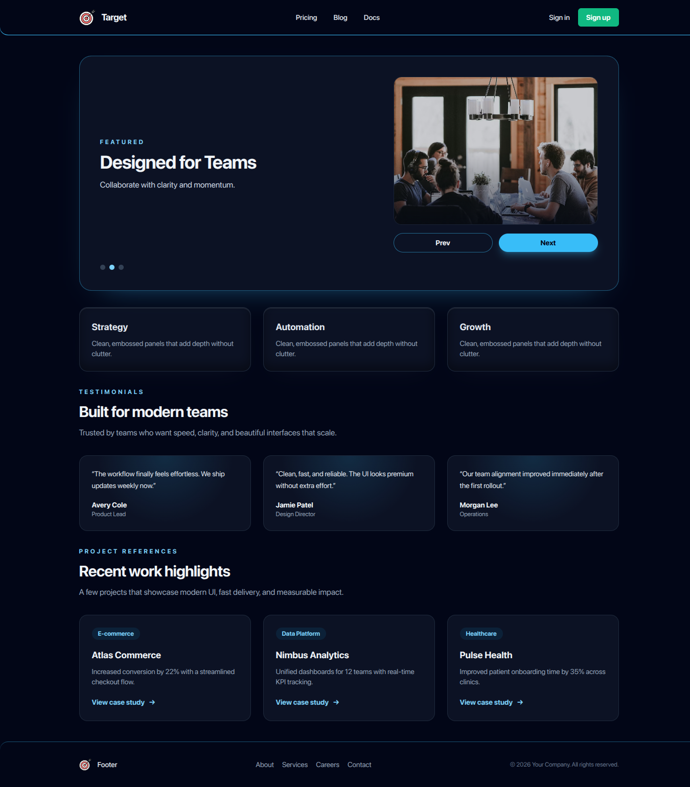

eact + Vite + Tailwind CSS
Minimal React + Vite starter configured with Tailwind CSS and example UI components.

Features

Vite fast dev server with HMR
React (JSX) components in src/
Tailwind CSS configured via tailwind.config.js
Example components under src/components/
Carousel Screenshot

Prerequisites

Node.js 16+ (LTS) and npm or yarn
Quick start

Install dependencies
npm install
Run development server
npm run dev
Build for production
npm run build
Preview the production build
npm run preview
Project layout (important files)

src/ — app source and components
public/ — static assets
tailwind.config.js — Tailwind configuration
vite.config.js — Vite configuration
Contributing

Open issues and pull requests on the repository. Keep changes small and focused.
License

Add a LICENSE file to declare an open-source license (e.g., MIT).
Thanks for using this starter — happy hacking!

React-vite-Tailwind-CSS
Developing portfolio landing page

This page was created to use Tailwind CSS for layout and repidly build morden web site. Using react for humberger menu items and profile setting.

IDE : cursor IDE for effective CI and CD development by utilizing AI features. IDE : VScode AI Agent + openAI +Gemini
